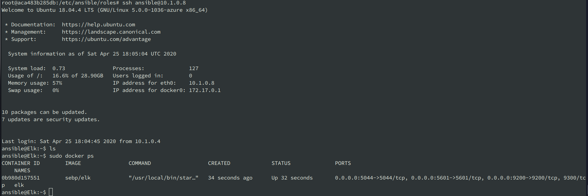

## Automated ELK Stack Deployment

The files in this repository were used to configure the network depicted below.

These files have been tested and used to generate a live ELK deployment on Azure. They can be used to recreate the entire deployment pictured above, or alternatively, select Ansible playbook files may be used to install only certain pieces of it, such as Filebeat.

  - _ansible/roles/elk-playbook.yaml_ : ELK server on a Ubuntu VM
  - _ansible/roles/filebeat-playbook.yml_ : Filebeat on the VMs in the backend pool
  - _ansible/roles/pentest.yaml_ : Damn Vulnerable Web Application (DVWA) on the Ubuntu backend VMs

This document contains the following details:
- Description of the Topology
- Access Policies
- ELK Configuration
  - Beats in Use
  - Machines Being Monitored
- How to Use the Ansible Build

### Description of the Topology

The main purpose of this network is to expose a load-balanced and monitored instance of DVWA, the Damn Vulnerable Web Application.

Load balancing ensures that the application will be highly available, in addition to restricting access to the network.
Furthermore, load balancers defend against distributed denial-of-service (DDoS) attacks through their off-loading functionality.

A jump box is utilized as a secure VM that admins first connect to before launching administrative tasks. 

Integrating an ELK server allows users to easily monitor the vulnerable VMs for changes to the server data and system logs.

The configuration details of each machine may be found below.

| Name        | Function           | IP Address | Operating System |
|-------------|--------------------|------------|------------------|
| Jump Box    | Gateway            | 10.0.0.1   | Ubuntu Linux     |
| Elk Server  | Monitoring System  | 10.0.0.7   | Ubuntu Linux     |
| DVWA-1      | Web Server         | 10.0.0.2   | Ubuntu Linux     |
| DVWA-2      | Web Server         | 10.0.0.3   | Ubuntu Linux     |

### Access Policies

The machines on the internal network are not exposed to the public Internet; they can only be accessed through the Jump Box. 

In the current configuration the only public-facing machines are the DVWA servers in the backend pool of the load balancer.  

A more detailed summary of the access policies in place here is coming soon.

### Elk Configuration

Ansible was used to automate configuration of the ELK machine. No configuration was performed manually, which is advantageous in terms of scalability and reproducibility.

The playbook implements the following tasks:
- Install Docker
- Install Python-Pip
- Set virtual memory
- Download and launch a docker ELK container

The following screenshot displays the result of running `docker ps` after successfully configuring the ELK instance.

### Target Machines & Beats
This ELK server is configured to monitor the machines in the load balancer backend pool:
- DVWA-1
- DVWA-2

We have installed the following Beats on these machines:
- Filebeats
- Metricbeats (coming soon)

These Beats allow us to collect the system logs from the two servers running the Damn Vulnerable Web Application.  

### Using the Playbook
In order to use the playbook, you will need to have an Ansible control node already configured. Assuming you have such a control node provisioned:

SSH into the control node and follow the steps below:
- Copy the playbook file to _/etc/ansible/roles_.
- Update the hosts file to include the IP of the ELK server.
- Run the playbook, and navigate to the ELK server IP, which is running Kibana on port 5601, to check that the installation worked as expected.

